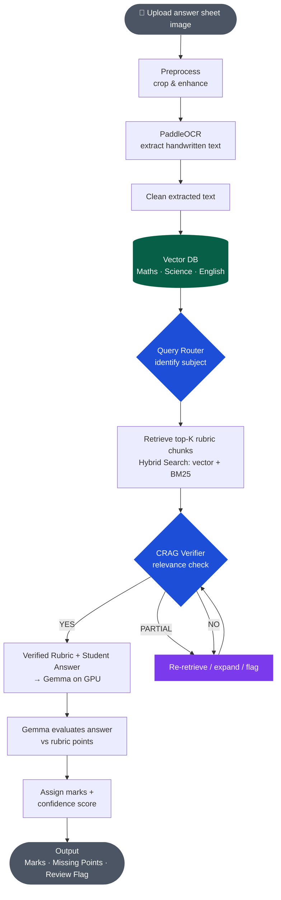

<div align="center">
  <picture>
    <source media="(prefers-color-scheme: dark)"  srcset="assets-readme/files/examinerAI_logo_dark.svg">
    <source media="(prefers-color-scheme: light)" srcset="assets-readme/files/examinerAI_logo_light.svg">
    
  </picture>
</div>
An end-to-end pipeline that ingests handwritten answer sheet images, extracts text via OCR, retrieves subject-specific rubrics from a vector database, and evaluates student answers using a local LLM — producing marks, missing-point feedback, and confidence scores.

---

## ✨ Features

- **Automated OCR** — Extracts handwritten text from scanned answer sheets using PaddleOCR
- **Multi-Subject Support** — Separate vector collections for Maths, Science, and English
- **Intelligent Query Routing** — Automatically identifies the subject and selects the correct rubric collection
- **Hybrid Retrieval** — Combines dense vector search with BM25 keyword search (top-K rubric chunks)
- **CRAG Verification** — Corrective Retrieval-Augmented Generation checks retrieved chunks for relevance before grading
- **LLM-Based Evaluation** — Gemma (GPU-accelerated) evaluates answers against rubric points
- **Structured Output** — Returns marks, confidence score, missing points, and a review flag for edge cases

---

## System Architecture



---

## 🗂️ Project Structure

```
ExaminerAI/
├── app/
│   └── main.py                # Application entry point
│
├── data/
│   ├── extracted_text/        # OCR-extracted text output
│   ├── processed_images/      # Preprocessed (cropped & enhanced) images
│   └── raw_images/            # Original uploaded answer sheet scans
│
├── pipeline/
│   ├── upload.py              # Image upload handler (Step 1)
│   ├── preprocess.py          # Crop, deskew, contrast enhancement (Step 2)
│   ├── ocr_extract.py         # PaddleOCR wrapper + text extraction (Step 3)
│   ├── text_clean.py          # Clean & normalise extracted text (Step 4)
│   ├── rag_retriever.py       # Query router, hybrid search & CRAG verifier (Steps 6a–6c)
│   ├── evaluator.py           # Gemma inference — answer vs rubric (Steps 7–8)
│   └── scoring.py             # Mark assignment + confidence scoring (Step 9)
│
├── requirements.txt
└── README.md
```

## Pipeline Deep Dive

### Step 2 — Preprocessing
Images are deskewed, contrast-enhanced, and cropped to isolate the answer region before OCR. This significantly improves extraction accuracy on low-quality scans.

### Step 3 — PaddleOCR
PaddleOCR runs a detection + recognition pipeline optimised for handwritten text. The output is a list of text blocks with bounding boxes.

### Step 5 — Vector DB Collections
Rubrics are pre-chunked and embedded (using a sentence-transformer model) into three separate collections — one per subject. Each chunk maps to a specific mark-scheme point.

### Step 6a — Query Router
A lightweight classifier (or prompt-based LLM call) determines the subject from the extracted answer text, then routes the query to the correct collection.

### Step 6b — Hybrid Search
Retrieval combines cosine-similarity vector search with BM25 keyword matching. The `HYBRID_ALPHA` parameter controls the blend. Results are re-ranked before passing to the verifier.

### Step 6c — CRAG Verifier
Each retrieved chunk is scored for relevance against the student answer. Chunks below `CRAG_THRESHOLD` trigger a re-retrieval with an expanded query. Partially relevant results are flagged for downstream handling.

### Step 7–9 — Gemma Evaluation
The verified rubric chunks and cleaned student answer are passed to Gemma with a structured grading prompt. Gemma returns marks per rubric point, a list of missing points, and an overall confidence estimate.

---

---

## Roadmap

- [ ] Web UI for teacher review and mark override
- [ ] Support equation recognition
- [ ] Fine-tuned subject-specific embedding models
- [ ] Batch processing for entire exam sets
- [ ] Export to CSV / PDF report cards

---

## Contributing

1. Fork the repository
2. Create a feature branch (`git checkout -b feature/my-feature`)
3. Commit your changes (`git commit -m 'Add my feature'`)
4. Push to the branch (`git push origin feature/my-feature`)
5. Open a Pull Request

---

## License

This project is licensed under the MIT License — see [LICENSE](LICENSE) for details.

---

## Acknowledgements

- [PaddleOCR](https://github.com/PaddlePaddle/PaddleOCR) — Handwritten text recognition
- [Gemma](https://ai.google.dev/gemma) — Open LLM for answer evaluation
- [Qdrant](https://qdrant.tech/) — Vector database for rubric retrieval
